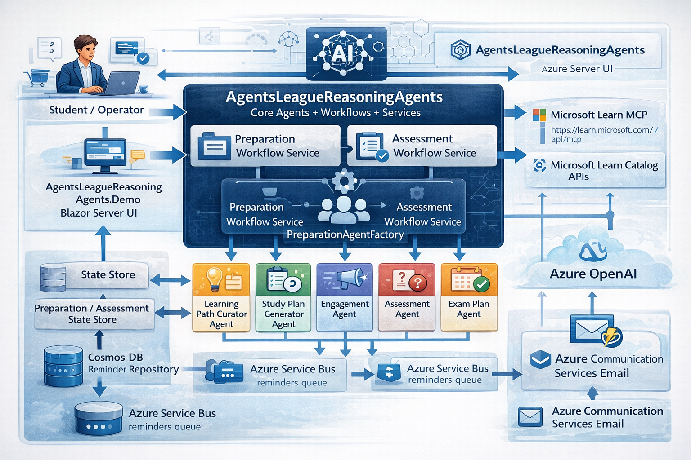
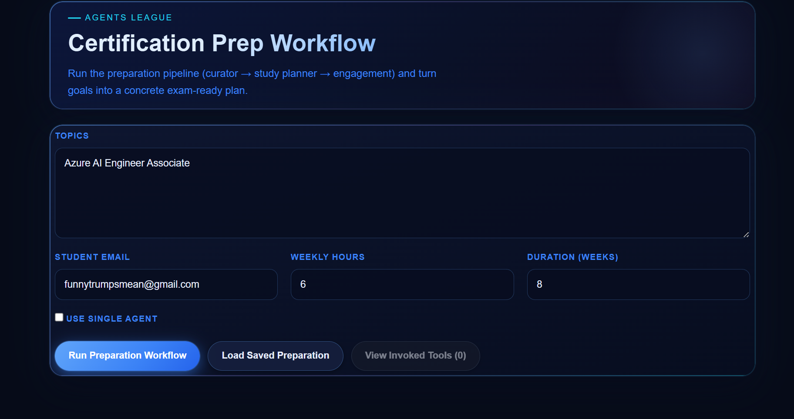
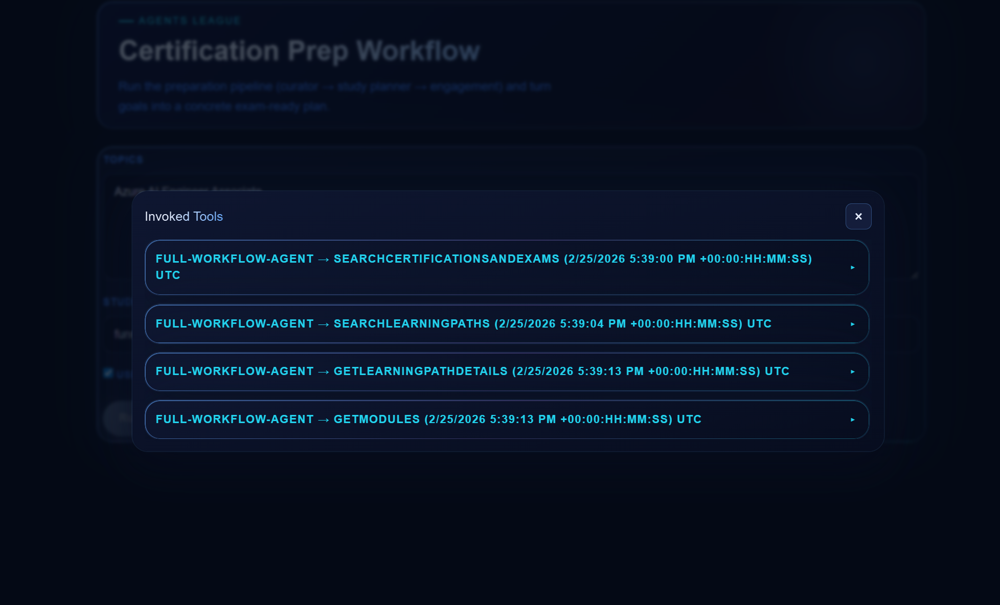
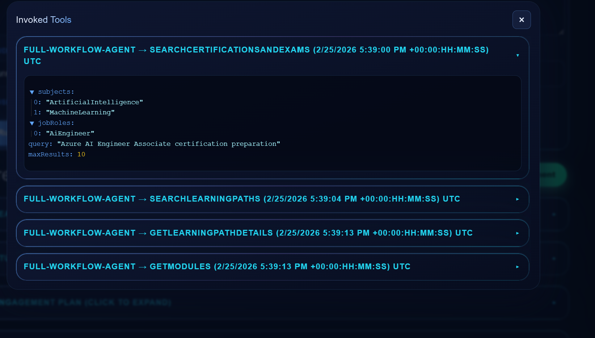
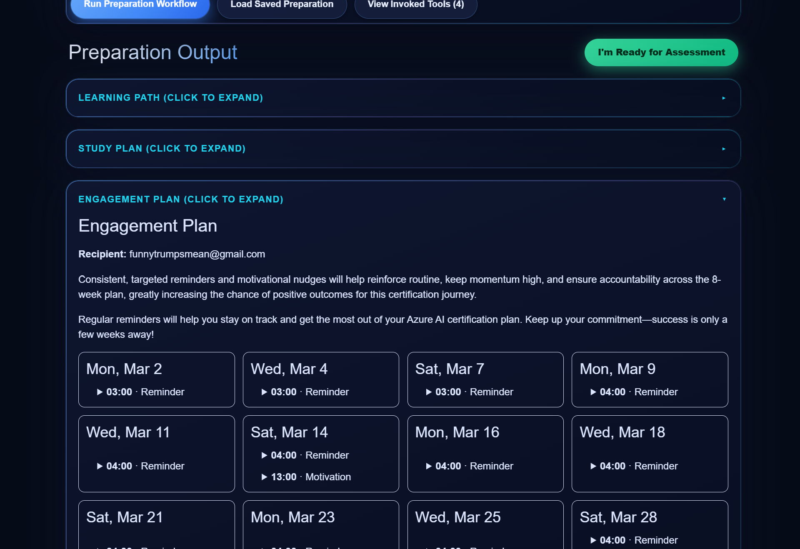
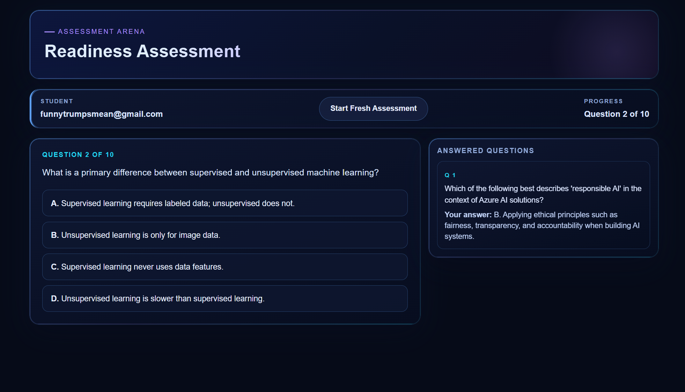

# 🎓 Agents League - Reasoning Agents: MS Certification Study Assistant

> **Track:** Battle #2 - Reasoning Agents · **Approach:** Local development with [Microsoft Agent Framework](https://github.com/microsoft/agent-framework) (.NET)

**A multi-agent system that guides students from "I want to learn Azure" to exam-ready - curating learning paths, generating study plans, scheduling reminder emails, and running a 10-question assessment, all driven by reasoning agents backed by Microsoft Learn.**

### 🔗 [Live Demo -> agent-league-mslearn-helper.azurewebsites.net](https://agent-league-mslearn-helper.azurewebsites.net/)

---

## What it does

A student enters their certification topics, available weekly hours, and study duration. The system then:

1. **Curates** the most relevant Microsoft Learn certifications, exams, and learning path modules for those topics.
2. **Generates** a milestone-based weekly study plan with practical daily sessions and direct links to each module.
3. **Schedules** personalized reminder and motivation messages - one per study session - persisted to Cosmos DB and queued for delivery via Azure Communication Services Email.
4. **Gates assessment**: after the student confirms readiness, the system produces a 10-question multiple-choice assessment aligned to their learning path. If they pass, it surfaces the relevant certification next steps; if not, the preparation workflow loops again.

---

## Architecture



Orchestration is handled by `IPreparationWorkflowService` and `IAssessmentWorkflowService`. The preparation phase offers two execution modes - see [Single-agent vs. Multi-agent](#single-agent-vs-multi-agent-preparation) below.

---

## Agent Roles & Reasoning

Full system instructions for every agent live in [`AgentsLeagueReasoningAgents/Agents/Prompts.cs`](./AgentsLeagueReasoningAgents/Agents/Prompts.cs).

### `learning-path-curator`
Uses the Microsoft Learn MCP server and the Learn Catalog API to find certifications, exams, and learning paths relevant to the student's topics. Applies step-by-step reasoning to extract key skills and filter to 1–3 high-value, well-matched paths with module-level detail.
→ Prompt: [`CuratorInstructions`](./AgentsLeagueReasoningAgents/Agents/Prompts.cs)

### `study-plan-generator`
Receives the curated resource list and reasons through topic groupings, dependencies, and pacing to produce a realistic weekly milestone plan broken into daily sessions - each with a direct URL to the relevant module unit.
→ Prompt: [`StudyPlannerInstructions`](./AgentsLeagueReasoningAgents/Agents/Prompts.cs)

### `engagement-agent`
Reviews the full study schedule and - for every session - pairs a personalized motivational reminder message with the direct resource link and the correct scheduled date/time. Output is a JSON array persisted as reminders.
→ Prompt: [`EngagementInstructions`](./AgentsLeagueReasoningAgents/Agents/Prompts.cs)

### `readiness-assessment`
Generates exactly 10 multiple-choice questions (four options, one correct answer, explanation) spanning fundamentals, applied understanding, and scenario reasoning — aligned to the student's curated path. Returns structured JSON scored against a pass threshold.
→ Prompt: [`ReadinessAssessmentInstructions`](./AgentsLeagueReasoningAgents/Agents/Prompts.cs)

---

## Single-agent vs. Multi-agent Preparation

One of the deliberate design explorations in this solution is running the same preparation workflow as **both** a traditional multi-agent pipeline and a single orchestrating agent, then comparing their behavior under evaluation.

### Multi-agent (`RunPreparationAsync`)
Three sequential agents with structured JSON handoffs enforced at each boundary:
```
learning-path-curator → study-plan-generator → engagement-agent
```
Each agent has a focused role and a schema-constrained output. The curator's JSON is validated before being passed to the planner; the planner's output is validated before the engagement agent schedules reminders. This enforces clean separation of concerns but introduces more serialization boundaries - and more failure surface.

### Single-agent (`RunSingleAgentPreparationAsync`)
One agent receives [`FullWorkflowAgentInstructions`](./AgentsLeagueReasoningAgents/Agents/Prompts.cs) - a combined prompt that walks through all three phases in a single pass with chain-of-thought reasoning between steps. The agent has access to the same toolset as the multi-agent pipeline. There are fewer inter-agent handoffs and no intermediate serialization boundaries.

### What evaluation showed
The single-agent mode outperformed the multi-agent mode in reliability across 10 test cases each:

| Workflow | Pass Rate | Composite Score | IntentResolution |
|---|---|---|---|
| `single-agent` | **70%** | **3.50** | **5.00 / 5** |
| `multi-agent` | 50% | 2.91 | 4.33 / 5 |

When both workflows completed successfully, all quality metrics (Coherence, Helpfulness, Relevance, TaskAdherence) were a perfect **5.0/5.0** for both modes. The single-agent mode's edge comes from fewer failure points: multi-agent failures were caused by null-reference exceptions and transient HTTP 404s at agent boundaries, while single-agent failures were datetime serialization edge cases in the reminder output. The multi-agent approach better enforces structured intermediate outputs and is more debuggable step-by-step; the single-agent approach is more resilient end-to-end.

---

## Reasoning Patterns Applied

| Pattern | Where |
|---|---|
| **Role-based specialization** | Each preparation agent has a single responsibility and focused toolset |
| **Planner–Executor** | `study-plan-generator` produces the plan; `engagement-agent` executes the scheduling |
| **Critic / Verifier** | `CreateFilterAgent<TOutput>` inside `LearnCatalogToolset` ranks and prunes raw catalog results before they reach the main agents |
| **Human-in-the-loop** | Preparation workflow pauses; student explicitly confirms readiness before assessment begins |
| **Self-reflection / retry loop** | If the student fails the assessment, the system branches back to the preparation workflow for another pass |
| **Chain-of-thought** | All agent prompts explicitly instruct step-by-step internal reasoning before producing final output |

---

## Tool & MCP Integrations

### `LearnCatalogToolset` (primary)
Queries the Microsoft Learn Catalog API via a typed `ILearnCatalogClient`. Exposes five AI tools — `SearchLearningPathsAsync`, `SearchModulesAsync`, `SearchCertificationsAndExamsAsync`, `GetModulesAsync`, `GetLearningPathDetailsAsync` — each with an internal LLM-based filter agent (`CreateFilterAgent<TOutput>`) that re-ranks results for relevance before returning them.

### `MicrosoftLearnMcpToolset` (primary)
Connects to the [Microsoft Learn MCP server](https://github.com/microsoftdocs/mcp) at `https://learn.microsoft.com/api/mcp` via `HttpClientTransport` and exposes every discovered MCP tool as an `AITool` available to the curator and planner agents.

<details>
<summary><strong>Optional enrichment toolsets (10)</strong></summary>

These toolsets in `AgentsLeagueReasoningAgents/Tools/Optional/` can be wired into any agent's toolset for richer context:

| Toolset | Purpose |
|---|---|
| [`ExamTopicsToolset`](./AgentsLeagueReasoningAgents/Tools/Optional/ExamTopicsToolset.cs) | Community-maintained free certification offers and voucher promotions |
| [`GitHubAnkiDeckToolset`](./AgentsLeagueReasoningAgents/Tools/Optional/GitHubAnkiDeckToolset.cs) | Flashcard extraction from open-source Anki decks for exam prep |
| [`GitHubCommunityHubToolset`](./AgentsLeagueReasoningAgents/Tools/Optional/GitHubCommunityHubToolset.cs) | Curated community resources: courses, labs, practice tests, videos, study guides |
| [`GitHubExamSyllabiToolset`](./AgentsLeagueReasoningAgents/Tools/Optional/GitHubExamSyllabiToolset.cs) | Structured exam syllabus/topic weights from a community JSON source |
| [`GitHubPracticeQuestionsToolset`](./AgentsLeagueReasoningAgents/Tools/Optional/GitHubPracticeQuestionsToolset.cs) | Community-maintained practice question banks for selected exams |
| [`GitHubStudyNotesToolset`](./AgentsLeagueReasoningAgents/Tools/Optional/GitHubStudyNotesToolset.cs) | Structured study notes from mapped GitHub repositories |
| [`OfficialLabExercisesToolset`](./AgentsLeagueReasoningAgents/Tools/Optional/OfficialLabExercisesToolset.cs) | Official MIT-licensed MicrosoftLearning lab instructions |
| [`PodcastFeedToolset`](./AgentsLeagueReasoningAgents/Tools/Optional/PodcastFeedToolset.cs) | Microsoft-focused podcast episodes relevant to exam topics |
| [`StackExchangeToolset`](./AgentsLeagueReasoningAgents/Tools/Optional/StackExchangeToolset.cs) | Stack Overflow Q&A for exam-related technical topics |
| [`YouTubeStudyContentToolset`](./AgentsLeagueReasoningAgents/Tools/Optional/YouTubeStudyContentToolset.cs) | Curated YouTube study videos with optional transcript retrieval |

</details>

---

## Evaluation Results

Evaluated using a dataset-driven runner (`AgentsLeagueReasoningAgents.Evals`) with 20 total cases across both workflow modes. Full report: [`eval_report_visualization.html`](./eval_report_visualization.html).

| Metric | Overall | Single-agent | Multi-agent |
|---|---|---|---|
| **Cases** | 20 | 10 | 10 |
| **Passed** | 12 (60%) | **7 (70%)** | 5 (50%) |
| **Composite score** | - | **3.50** | 2.91 |
| Coherence | - | 5.00 / 5 | 5.00 / 5 |
| Helpfulness | - | 5.00 / 5 | 5.00 / 5 |
| Relevance | - | 5.00 / 5 | 5.00 / 5 |
| TaskAdherence | - | 5.00 / 5 | 5.00 / 5 |
| IntentResolution | - | **5.00 / 5** | 4.33 / 5 |

**Key insight:** When both workflows complete without runtime errors, quality is equivalent across all metrics. The single-agent mode achieves a higher pass rate because it has fewer inter-agent serialization boundaries that can fail. Multi-agent failures were primarily null-reference exceptions and transient HTTP 404s at handoff points; all single-agent failures were datetime parsing edge cases in reminder JSON output.

---

## Projects

| Project | Description |
|---|---|
| `AgentsLeagueReasoningAgents/` | Core agents, workflows, toolsets, services, and models |
| `AgentsLeagueReasoningAgents.Demo/` | Blazor Server app - the live demo UI |
| `AgentsLeagueReasoningAgents.Evals/` | Dataset-driven evaluation runner with LLM-as-judge metrics |
| `AgentsLeagueReasoningAgents.EmailFunction/` | Azure Functions isolated worker - sends scheduled reminder emails from a Service Bus queue |
| `MSLearnPlatformClient/` | Typed HTTP client for the Microsoft Learn Catalog API |

---

## Demo screenshots

### Start page



### Tool modal



### Tool details



### Output example



### Assessment agent

