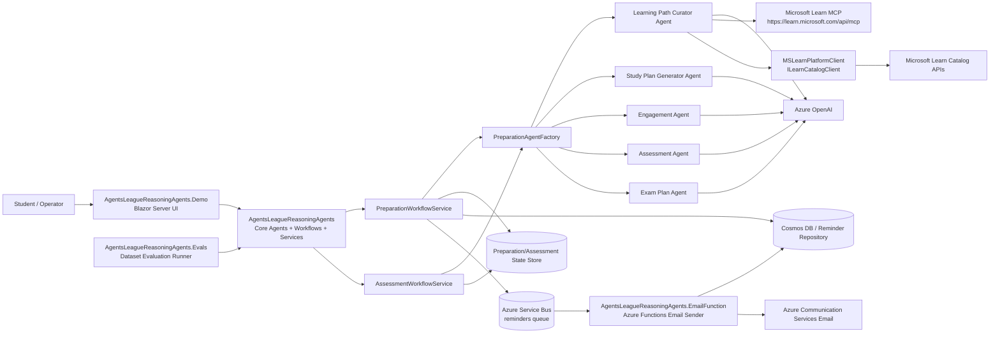

# Solution Architecture

```mermaid
graph LR
  %% === Applications ===
  User[Student / Operator]
  Demo[AgentsLeagueReasoningAgents.Demo\nBlazor Server UI]
  Core[AgentsLeagueReasoningAgents\nCore Agents + Workflows + Services]
  Evals[AgentsLeagueReasoningAgents.Evals\nDataset Evaluation Runner]
  EmailFn[AgentsLeagueReasoningAgents.EmailFunction\nAzure Functions Email Sender]

  %% === Core internals ===
  PrepWF[PreparationWorkflowService]
  AssessWF[AssessmentWorkflowService]
  AgentFactory[PreparationAgentFactory]
  Curator[Learning Path Curator Agent]
  Planner[Study Plan Generator Agent]
  Engage[Engagement Agent]
  AssessAgent[Assessment Agent]
  ExamPlan[Exam Plan Agent]

  %% === Shared client/library ===
  LearnClient[MSLearnPlatformClient\nILearnCatalogClient]

  %% === Data & messaging ===
  StateStore[(Preparation/Assessment State Store)]
  ReminderRepo[(Cosmos DB / Reminder Repository)]
  ServiceBus[(Azure Service Bus\nreminders queue)]

  %% === External services ===
  AzureOpenAI[Azure OpenAI]
  LearnMCP[Microsoft Learn MCP\nhttps://learn.microsoft.com/api/mcp]
  LearnCatalog[Microsoft Learn Catalog APIs]
  ACSEmail[Azure Communication Services Email]

  %% === User/app flow ===
  User --> Demo
  Demo --> Core
  Evals --> Core

  %% === Core orchestration ===
  Core --> PrepWF
  Core --> AssessWF
  PrepWF --> AgentFactory
  AssessWF --> AgentFactory

  AgentFactory --> Curator
  AgentFactory --> Planner
  AgentFactory --> Engage
  AgentFactory --> AssessAgent
  AgentFactory --> ExamPlan

  %% === Agent dependencies ===
  Curator --> AzureOpenAI
  Planner --> AzureOpenAI
  Engage --> AzureOpenAI
  AssessAgent --> AzureOpenAI
  ExamPlan --> AzureOpenAI

  Curator --> LearnMCP
  Curator --> LearnClient
  LearnClient --> LearnCatalog

  %% === Persistence/scheduling ===
  PrepWF --> StateStore
  AssessWF --> StateStore
  PrepWF --> ReminderRepo
  PrepWF --> ServiceBus

  %% === Reminder delivery path ===
  ServiceBus --> EmailFn
  EmailFn --> ReminderRepo
  EmailFn --> ACSEmail
```
